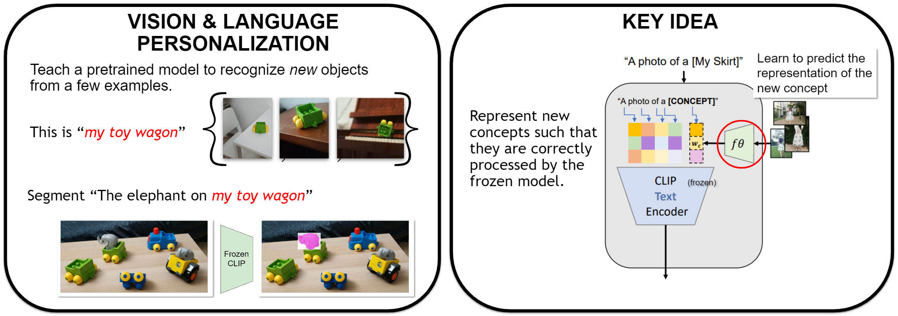

<p align="center"></p>

# Personalizing Frozen Vision-Language Representations


This reporsitory contains the annotations and scripts for the algorithm described in the paper 

> "This is my unicorn, Fluffy": Personalizing frozen vision-language representations , *Niv Cohen, Rinon Gal, Eli A. Meirom, Gal Chechik, Yuval Atzmon*, ECCV 2022 (Oral)


## Setup
1. Make sure you have miniconda or anaconda installed
2. Install and activate the project conda environment
```
conda env create --file ./environment.yaml
conda activate palavra
pip install git+https://github.com/openai/CLIP.git
```

## Train f_theta
1. Download and prepare the data folders and captioning files as explained in the PerVL Benchmark project: <br> https://github.com/NVlabs/PerVLBenchmark <br>
We assume the training set were created under: `../PerVLBenchmark/data`
2. Call the `get_f_theta.py` script to create an f_theta model: <br>
```
WANDB_MODE=offline python get_f_theta.py --object_dict_path="../PerVLBenchmark/data/inversion_model_train_data/txt_for_training/commom_obj_dict.npy" --visual_features_path="../PerVLBenchmark/data/inversion_model_train_data/visual_features/visual_features_dict_center_crop_300_224.npz" --text_aug_map_path="../PerVLBenchmark/data/inversion_model_train_data/open_images/open_images_to_mscoco_map.npz" --text_obj_path="../PerVLBenchmark/data/inversion_model_train_data/open_images/open_images_obj_names.npz" --batch_size=256 --coeff_gt_object_loss=512 --data_path=data/deep_fashion/experiment_sets/test_2022_02_07-16_42_59/ --deep_set_d_dim=4096 --dropout=0.25 --epochs=300 --is_augment_object=True --is_gt_object_loss=True --is_image_input_test=True --is_image_input_train=True --is_prompt_multi=True --is_save_models=True --is_text_visual_map=True  --lr=0.0001  --no_of_new_tokens=1  --pooling_type=mean  --sentence_wise_split=True --set_size=5
```

The model is saved under ../sandbox/checkpoints/ as a default.

## Retrival on PerVL Benchmarks
1. Download and prepare the data folders and captioning files as explained in the PerVL Benchmark project: <br> https://github.com/NVlabs/PerVLBenchmark <br>
We assume the evaluation set were created under: `../PerVLBenchmark/data`
2. Call the `caption_retrival_eval.py` script using the trained f_theta model, and the desired dataset as below. 
Note that the model can be found under ../sandbox/checkpoints/, and is identified
using a `"%YYYY_%mmm_%dd-%HH_%MM_%SS"` string (e.g. `2022_07_18-04_00_07`)  describing its creation time. <br>
### Youtube_vos retrieval example

```
WANDB_MODE=offline python caption_retrival_eval.py --data_path=../PerVLBenchmark/data/youtube_vos/retrival_sets/test --set_captions_path=../PerVLBenchmark/annotations/ytvos/cleaned_captions_ytvos_test.csv --captions_path=../PerVLBenchmark/annotations/ytvos/ytvos_joint_captions.csv --batch_size=256 --coeff_gt_object_loss=512 --is_constant_caption_abl=False --is_optimize_token=True --is_short_captions=True --is_token_as_suffix=True --is_train_loader_no_reps=False --is_class_name_folders=True --latent_ep=30 --no_fsl=False  --random_seed=5  --set_size=5  --token_optimize_mode=1 --model_name  2022_07_18-04_00_07
```
Note that the flag `is_class_name_folders` is set to `True`, as the ytvos dataset coarse grained class names are found in their folder name. 

### DeepFashion2 retrieval example


```
WANDB_MODE=offline python caption_retrival_eval.py --data_path=../PerVLBenchmark/data/deep_fashion2/personalized_test --set_captions_path=../PerVLBenchmark/annotations/deep_fashion/test_captions.csv --captions_path=../PerVLBenchmark/annotations/deep_fashion/shortened_deepfashion2_captions.csv --coarse_gained_class_names_path=../PerVLBenchmark/annotations/deep_fashion/train_coarse_grained_names.csv --batch_size=256 --coeff_gt_object_loss=512 --is_constant_caption_abl=False --is_optimize_token=True --is_short_captions=True --is_token_as_suffix=True --is_train_loader_no_reps=False --is_class_name_folders=False --latent_ep=30 --no_fsl=False  --random_seed=5 --set_size=5  --token_optimize_mode=1 --model_name  2022_07_18-04_00_07 
```
Note that you can also use `--captions_path=../PerVLBenchmark/annotations/deep_fashion/detailed_deepfashion2_captions.csv` for the detailed caption evalution. 

## Segmentation on PerVL Benchmarks

For evaluating the semantic segmentation results we used the code provided by the authors of Zabari et al. "Semantic Segmentation In-the-Wild Without Seeing Any Segmentation Examples".
The authors haven't made their code publicly available yet. So we cannot release yet our corresponding code. We will release our code, once Zabari et al. code becomes publicly available.

## Cite the paper
If you use the contents of this project, please cite our paper.

    @inproceedings{eccv2022_palavra_cohen,
     author = {Cohen, Niv and Gal, Rinon and Meirom, Eli A. and Chechik, Gal and Atzmon, Yuval},
     booktitle = {European Conference on Computer Vision (ECCV) },
     title = {"This is my unicorn, Fluffy": Personalizing frozen vision-language representations},
     year = {2022}
    }

For business inquiries, please contact [researchinquiries@nvidia.com](researchinquiries@nvidia.com) <br>
For press and other inquiries, please contact Hector Marinez at [hmarinez@nvidia.com](hmarinez@nvidia.com)
